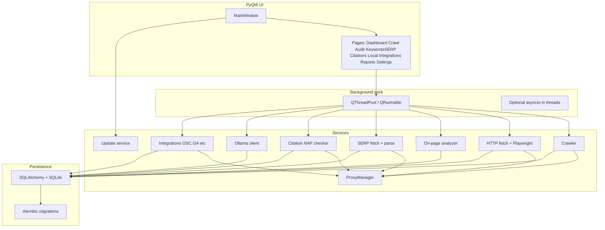
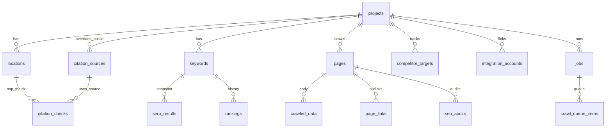
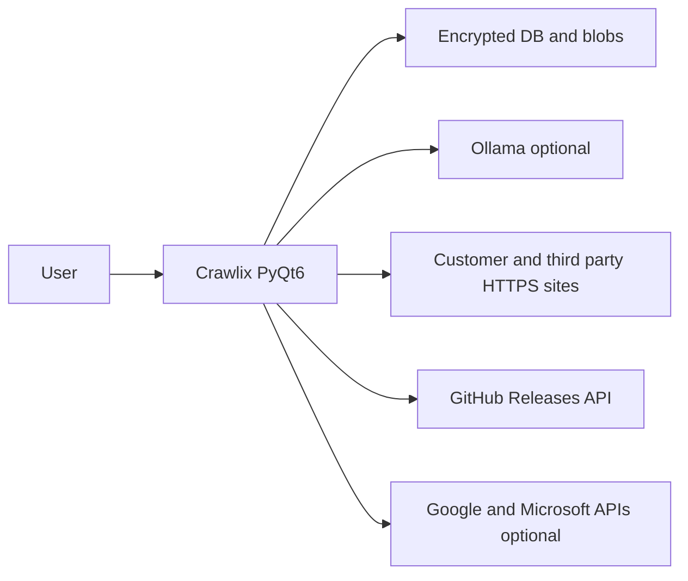
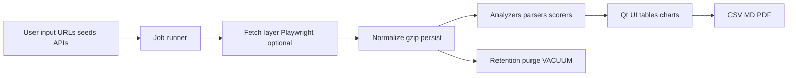

# Crawlix — Full product plan (pure Python)

**Document split:** this file is the **end-to-end product + engineering specification** (what exists, how it behaves, how data moves, how it is secured and released). **Milestone order** (which phases ship which **J** journeys and **epics**) is **canonical in [Delivery phasing (milestones)](#delivery-phasing-milestones)** below. **Calendar, staffing, and dates** live only in **`docs/roadmap-phases.md`** (mirror of that table + velocity), written after spec freeze — dates do not drive scope.

## Purpose and positioning

**Crawlix** is a **local-first, privacy-oriented** desktop SEO and local-marketing workstation: technical site work, keywords, SERP/rank intelligence, citations and NAP, optional **search-console and analytics** ties, **GBP- and review-oriented** workflows where APIs or user data allow, reporting, and **optional local LLM** (Ollama) — without mandatory cloud or subscription.

**Target users:** freelancers, small agencies, SMBs, and in-house marketers who want **SaaS-grade depth** with **data on disk they control**.

### Explicit product non-goals (vision-level)

- **No guarantee** of rankings, traffic, or revenue outcomes.
- **Not** a replacement for Google’s official consoles as **legal system of record** — integrations are **read/analysis aids** unless otherwise stated.
- **Not** a web-scale backlink index in the Ahrefs sense — any link features stay **honest** (sampled checks, imports, or API-backed where the user provides access).
- **Team / cloud sync** — only if explicitly added later as an **optional** layer; default product remains **single-machine, local DB**.

---

## Canonical repository (Git remote)

- **HTTPS:** `https://github.com/cowebsLB/Crawlix.git`
- **GitHub web:** `https://github.com/cowebsLB/Crawlix`
- **API slug (updater / CI):** `cowebsLB/Crawlix`

**Initial remote (when the local repo has no `origin` yet):**

```bash
git remote add origin https://github.com/cowebsLB/Crawlix.git
```

If `origin` already exists, use `git remote set-url origin https://github.com/cowebsLB/Crawlix.git` instead.

---

## Locked product decisions (from stakeholder input)

| Topic | Decision |
|--------|----------|
| GUI | **PyQt6** — see licensing note below before first public binary. |
| Platforms | **Windows, macOS, and Linux** — full parity for **releases and CI** (exact order of polish per OS is a phasing decision). |
| Rank / SERP | **Automated fetching** with **conservative defaults** (slow rates, backoff, clear opt-in copy and user responsibility disclaimer). |
| Local / citations | **Citation / NAP audit across directories** is **in the full product** (see dedicated section). |
| AI | **Recommended**: first-run experience **nudges** Ollama; app remains usable when Ollama is missing but AI-assisted summaries/clustering are degraded or hidden. |
| Distribution | **Both**: `pip`/venv for contributors and **official binaries** for end users (PyInstaller-style unless phased roadmap picks another packager). |

### Locked product decisions — round 2 (detail / risk reduction)

| Topic | Decision | Plan implication |
|--------|----------|------------------|
| Charts | **Matplotlib** embedded in Qt (`FigureCanvasQTAgg`) | Heavier dependency; familiar API; test HiDPI on Win/Mac/Linux early. |
| Citation templates | **Global minimal** starter pack | Few bundled patterns; **custom URL templates** and community-maintained YAML packs are the main path; document how users contribute templates. |
| Python version | **Compatibility-first** | Lock `requires-python` to **>=3.11,<3.14** initially; run **CI on 3.11 + 3.12**; re-evaluate **3.13** when PyQt6 + Playwright + Matplotlib wheels are green on all three OSes. |
| Telemetry | **None** | No third-party crash SDK; **local rotating log files** + “Export debug bundle” (zip of logs + anonymized settings) for support. |
| Proxies | **Rotating list** + **job stickiness** | **ProxyManager** shared by crawl, SERP, citations; **round-robin between jobs**, **sticky proxy + cookie jar inside one SERP/crawl logical job** (see ProxyManager section) so redirects/consent are not split across IPs. |
| HTML retention | **Default: store full HTML** where fetches succeed | **High disk growth** — mandatory **gzip compression**, **per-project max DB size** soft warning + hard cap option, **retention policy** (e.g. keep last N SERPs per keyword), **purge** tools, scheduled **VACUUM** guidance. |
| i18n | **All languages (goal)** | **English** ships first; **Qt Linguist** (`.ts` → `.qm`) pipeline, **RTL layout** rules (Arabic, Hebrew), **locale selector**; additional languages ship as **contrib locale packs** without blocking core SEO engine work. |
| Updates | **Auto-download** installers | Highest security load: **verify checksums** against published manifest, **HTTPS-only**, **no silent drive-by** — user confirmation before apply; per-OS installer behavior documented below. |

### Locked product decisions — round 3 (security / release)

| Topic | Decision | Plan implication |
|--------|----------|------------------|
| Code signing | **Windows Authenticode from first public Windows release**; **macOS + Linux unsigned initially** with honest docs | CI uploads Windows signed artifact; Mac/Linux users see **Gatekeeper / AppArmor** guidance; updater UX warns platform-specific trust issues; **notarization** as a later milestone on the phased roadmap. |
| DB encryption | **Required for production use** — **SQLCipher** (or equivalent) for SQLite at rest | **Major engineering track:** user **master password** / key derivation, **lock on idle**, **backup/export** flows, driver packaging for PyInstaller on **three** OSes, SQLAlchemy dialect compatibility, **migration path** from plaintext **dev-only** DBs. |

### PyQt6 and licensing (action for you + legal reviewer)

PyQt is distributed under the **GNU GPL v3** unless you purchase a **commercial license** from Riverbank Computing. Shipping a **binary** that links PyQt6 can trigger **copyleft** obligations that may or may not align with “MIT source on GitHub” depending on how you distribute and what you link. **Before public binaries:** confirm strategy: (a) comply with GPL for distributed app artifacts, (b) purchase a commercial PyQt license, or (c) switch binding to **PySide6 (LGPL)** for simpler proprietary-friendly binaries while keeping MIT code.

---

## Product pillars (what reviewers should validate)

1. **Privacy** — **SQLCipher-encrypted** SQLite on disk (keys never logged); **no telemetry or third-party crash reporting** (product default); outbound network only for user-initiated fetches/scrapes, **GitHub Releases update checks** (see updater section), optional **cloud integrations** when the user adds keys, and optional **Ollama** on localhost.
2. **Honesty** — Label scraped SERP / autocomplete data as *approximate*; avoid implying official Google volumes without API-backed data.
3. **Maintainability** — One language (Python), clear separation: UI (Qt) vs workers vs services vs persistence.
4. **Sustainability** — MIT license, documented legal/ethical scraping stance, dependency pinning, CI for tests and builds.

---

## Architecture (desktop-native)



**Concurrency model:** use **Qt threads** (`QThreadPool` / `QRunnable` + signals) for long jobs; optional **asyncio** inside a dedicated thread for Playwright/async HTTP. **No FastAPI/Celery/Redis required** for the core desktop product. Add a **localhost HTTP plugin API** (e.g. FastAPI in a sidecar process) only if the phased roadmap calls for third-party automation.

---

## Recommended technology stack

| Layer | Choice | Notes |
|--------|--------|--------|
| GUI | **PyQt6** (locked) | See GPL/commercial license note above for binary distribution. |
| DB | **SQLCipher** + **SQLite** + **SQLAlchemy 2.x** + **Alembic** | Use maintained Python binding / SQLCipher build; validate **SQLAlchemy** `create_engine` URL and **Alembic** migrations against encrypted file; **dev mode** optional plaintext DB behind explicit env flag only. |
| HTTP / parse | **httpx** or **aiohttp**, **selectolax** or **lxml** + optional **beautifulsoup4** | Fast HTML; BS4 only where convenience wins. |
| JS rendering | **Playwright** (async API in worker thread) | For SPAs and Core Web Vitals–adjacent checks when you add them. |
| Crawling | Start with **custom BFS/queue + httpx**; introduce **Scrapy** only if you need spider middlewares at scale | Scrapy adds process/model complexity inside a GUI app; defer until crawl scope grows. |
| Data / NLP | **pandas** (exports, tables), **rapidfuzz** / **regex** for light NLP; **scikit-learn** optional for clustering | Add spaCy only if you need serious NLP and accept larger installs. |
| Local AI | **Ollama HTTP API** (e.g. Qwen 2.5 3B) | Keep AI **optional**: app runs if Ollama is absent; features degrade gracefully. |
| Charts | **Matplotlib** + `matplotlib.backends.backend_qtagg` | Embed in Qt widgets; watch **bundle size** on PyInstaller; test **dark theme** parity for axes/labels. |
| Proxies | **User-defined list**, **round-robin** | Single module used by crawl, SERP, citations; respect per-proxy auth; mark failures; optional “disable proxies” toggle per job type. |
| i18n | **Qt Linguist** (`.ts` / `.qm`) + **RTL** layouts | **English** `.qm` bundled first; additional languages via `resources/locales/*.qm` loadable packs; never block releases on full translation coverage. |
| Python | **>=3.11,<3.14** (start); **CI on 3.11 + 3.12** | Revisit 3.13+ after wheel ecosystem proves stable for PyQt6 + Playwright + Matplotlib on all OSes. |
| Updates | **Auto-download** (see dedicated section) | Must include **checksum verification** + **user confirm** before running installer; document unsigned-binary warnings for early releases. |
| Packaging | **PyInstaller** (+ platform notes for Playwright browser bundles) | Document “first run” browser download or ship a scripted bootstrap. |
| Tests | **pytest** + **pytest-qt** for UI smoke tests | Unit-test analyzers, URL normalization, **ProxyManager**, and **updater checksum** logic heavily. |

---

## Repository layout (single package)

```text
crawlix/
  pyproject.toml              # deps, ruff/black, project metadata
  README.md
  LICENSE
  src/crawlix/
    __init__.py
    main.py                   # QApplication entry
    config.py                 # paths; PolitenessDefaults (see politeness section); Ollama URL; feature flags
    db/
      session.py              # engine, session factory
      models/                 # SQLAlchemy models (mirror prior schema)
      migrations/             # Alembic
    ui/
      main_window.py
      pages/                  # see UI/UX spec: dashboard, crawl, audit, keywords_serp, citations, local, integrations, reports, settings
      widgets/                # tables, charts, progress, log panel
      styles/                 # dark palette (QSS or centralized constants)
    workers/                  # QRunnable jobs: crawl, audit batch, rank check run
    services/
      crawler/                # queue, robots, fetch, dedupe, store pages
      analyzer/               # on-page scoring, issues JSON
      scraper/                # careful SERP/autocomplete helpers + disclaimers
      tracker/                # scheduled rank snapshots
      citations/              # NAP normalize, source URL resolve, fetch, score, report
      ai/                       # Ollama client + prompt templates + response cache table
      updater/                  # GitHub Releases metadata, download, verify, spawn installer (platform-specific)
      integrations/             # GSC, GA4, Bing WM, OAuth/token handling, sync jobs (feature-flagged)
      net/                      # Shared HTTP client hooks + ProxyManager integration (optional split)
    utils/                      # url normalize, logging, export csv/xlsx
  locales/                      # Qt .ts sources; CI builds .qm into resources/locales
  tests/
    unit/
    integration/
  resources/                  # icons; citation_sources_default.yaml (starter pack); shipped **.qm** locale binaries
```

---

## UI and UX specification (navigation, patterns, language)

**Goal:** one coherent mental model — **Project → run Jobs → inspect Results → export Reports** — so occasional users do not get lost between “Crawl”, “Audit”, “SERP”, and “Citations”. Implementation: **PyQt6** + **QSS dark theme** + **Matplotlib** inside content areas; all strings through **`tr()`** per i18n plan.

### Design principles

1. **Project context is always explicit** — the active **project** appears in the **top bar** (combo or breadcrumb). No page applies silently to “whatever project was last touched”.
2. **Jobs are never silent** — every long action creates or updates a row in **Jobs** with progress; the **Job dock** shows what is running without hunting.
3. **Honest states** — use **Degraded**, **Blocked**, **Needs review** instead of fake success greens when data is partial.
4. **Scannable density** — tables first; charts second; detail in **drawer** or **bottom inspector**, not only modal towers.
5. **Defaults visible** — politeness numbers and preset name surface in **Status bar** or **Methodology** link so “why is this slow?” is answered in one click.

### Global shell (every screen)

| Area | Contents |
|------|-----------|
| **Menu bar** | **File:** New project, Open data folder, Recent projects, Backup DB, Exit. **Jobs:** Open job queue, Cancel selected, Clear finished. **Tools:** Open logs folder, Export debug bundle (with checklist dialog). **Help:** User guide, **Methodology & rate limits**, Privacy & automation disclaimer, Check for updates. |
| **Top bar** | App name + **Project switcher** (required) + optional **environment badge** (e.g. “Aggressive politeness”). |
| **Sidebar** | Vertical nav — **order matches typical workflow** (see below). Icons + short labels; current page highlighted. |
| **Content area** | `QStackedWidget` or equivalent: page fills space; each page has **title + short subtitle** (“What you do here in one sentence”). |
| **Job dock** (bottom, collapsible) | **Tabs:** `Jobs` (table: type, project, progress %, ETA, status, actions) \| `Log` (monospace, filter by job id). **Pinned** minimum height ~120 px expanded. |
| **Status bar** | Politeness **preset name**; **Proxy:** On/Off count; **DB:** Locked/Unlocked; **Last job:** icon + one word (Idle / Running / Failed). Click opens Job dock. |

### Information architecture — sidebar order (single source of truth)

Use these **user-facing names** in the product (code module names may differ):

| # | Sidebar item | Subtitle (shown under title) | Primary user action |
|---|----------------|-------------------------------|----------------------|
| 1 | **Dashboard** | “Overview for this project” | Cards: last jobs, disk usage vs budget, quick links to run Crawl / SERP / Citations; **empty:** “Create a location or run a crawl to see activity.” |
| 2 | **Crawl** | “Map this site’s pages and links” | Seed URLs, depth, presets → **Start crawl** → live table + graph export; link “Open pages in Audit”. |
| 3 | **Audit** | “On-page SEO scores and issues” | Pick URLs (from crawl or paste) → **Run audit** → sortable issues table + score; **Open in Reports**. |
| 4 | **Keywords & SERP** | *Single area — avoids splitting concepts* | **Tabs:** `Keywords` (lists, tags, import CSV) \| `SERP snapshots` (run snapshot, see HTML stored / degraded) \| `Rank history` (table + Matplotlib; provenance column). |
| 5 | **Citations** | “NAP vs directories” | Locations panel + source toggles → **Run matrix** → heatmap/table + per-cell status (OK / blocked / review). |
| 6 | **Local** | “GBP-oriented checklist (when ready)” | Placeholder friendly: “Connect integrations first” or checklist stub — no fake buttons. |
| 7 | **Integrations** | “Search Console, Analytics, …” | Card per provider: **Connect** / **Sync now** / **Last sync**; token status clear. |
| 8 | **Reports** | “Export and client handoff” | Pick module outputs → format (CSV / Markdown / …) → **Export**; optional “Send to folder”. |
| 9 | **Settings** | “App, network, AI, privacy” | **Grouped list** left, detail right: General, Politeness & fetch, Proxies, Ollama (Fast/Deep), Locale, Data & retention, Updates, Advanced. |

**Architecture diagram note:** replace loose page lists in code comments with this **sidebar order** so engineers and UX stay aligned.

### First-run wizard (modal wizard, 6 steps max)

| Step | Screen title | User sees / does |
|------|----------------|------------------|
| 1 | Welcome | What Crawlix is / is not; **Continue** |
| 2 | Data folder | Choose/create app data directory; disk space hint |
| 3 | Master password | Create + confirm; link “Why we encrypt” |
| 4 | Automation disclaimer | Checkbox: I understand automated fetches may violate third-party ToS; link to README legal |
| 5 | Politeness preset | Radio: Conservative (default) / Normal / Aggressive (extra checkbox) — **show numeric summary** from politeness table |
| 6 | Ollama (optional) | Detect port / install hint / **Skip** |

**Finish** → unlock DB shell with empty Dashboard and **sidebar tour** tooltip (skippable).

### Recurring UI patterns (copy-paste rules for contributors)

| Pattern | Rule |
|---------|------|
| **Primary button** | One per screen region (e.g. **Start crawl**); use verb + object. |
| **Destructive** | Secondary style + confirm dialog; for **delete project** require typing project name. |
| **Tables** | Sortable columns; sticky header; row actions `…` menu; **double-click** opens **Inspector** drawer (URL, last job, scores). |
| **Filters** | One search box where possible; advanced filters in collapsible panel — not 6 visible rows by default. |
| **Long jobs** | Progress bar + **ETA text** + **Cancel**; on cancel show “Finishing safe stop…” then partial results with **Degraded** badge. |
| **Errors** | Toast or banner with **error code** (internal id) + human message + **Copy details** (no secrets). |
| **Empty states** | Illustration optional; always **one sentence** + **primary CTA** (“Add your first keyword”). |
| **Charts** | Matplotlib: redraw on **tab focus** or **data changed** debounced — not every progress tick. |

### Terminology glossary (reduce confusion)

| User-visible term | Definition (tooltip + docs) |
|-------------------|----------------------------|
| **Project** | A client or site workspace; all crawls, keywords, and reports belong to one project unless exported. |
| **Job** | One tracked run (crawl, audit, SERP batch, …); can fail, pause, or degrade; appears in Job dock. |
| **Snapshot** | One captured SERP HTML + parsed rows at a moment in time. |
| **Ranking** | A position derived from a snapshot or manual/API import (`provenance` column explains which). |
| **Degraded** | Run finished but some steps failed (CAPTCHA, timeout) — partial data is still saved. |
| **Blocked** | Site or directory refused automated access — not a bug; try manual or proxy. |
| **Politeness preset** | Named bundle of delays and concurrency — not “VPN speed”. |
| **Location** | One business NAP entity (golden record) used by Citations. |

### Color and status chips (semantic)

Align QSS with product status vocabulary: **OK** (secondary green), **Running** (blue pulse), **Degraded** (amber), **Failed** (red), **Blocked** (slate), **Needs review** (violet). **Never** use red for “blocked by ToS” — that is not a crash.

### Accessibility (baseline)

- Full keyboard path for **sidebar**, **tables**, **Job dock**, **wizard** (tab order documented).  
- `accessibleName` on icon-only buttons.  
- Respect **system font scale** where Qt allows; minimum body **12 pt** effective.

### Where this lives in-repo

- **`docs/ui/overview.md`** — screenshots when available; link from README.  
- **`docs/ui/glossary.md`** — same table as above for translators.  
- **QSS** in `src/crawlix/ui/styles/` — single file + semantic tokens (avoid scattering hex in pages).

---

## Encrypted database (SQLCipher) — expanded spec (product requirement)

**Why:** agencies store client domains, NAP, and fetched HTML — **encryption at rest** is a differentiator vs “local but plaintext.”

**Minimum requirements:**

1. **Key material:** derive key from **user master password** using a modern KDF (**Argon2id** via `argon2-cffi` or similar) + random per-database salt stored alongside DB header; optional **Windows Hello / macOS Keychain** unlock later as stretch — **initial releases** may be password-only if simpler, documented.
2. **Session lifecycle:** DB connection opened after unlock; **lock on idle** timeout (configurable); **clear memory** of password string after derive where feasible.
3. **Recovery:** user must understand **no cloud reset** — export a **recovery key** once (QR/paper backup) if you implement **two-factor file** pattern; at minimum: **export encrypted backup** + password manager recommendation.
4. **Alembic:** migrations run against unlocked engine; ship **dry-run migration** tests in CI using ephemeral encrypted DB files.
5. **Packaging risk:** SQLCipher native libs must ship inside PyInstaller — **per-OS build jobs** produce artifacts; add health check on startup: “SQLCipher loaded OK”.
6. **Performance:** encrypted page cache tuning; batch writes during crawls to avoid excessive re-encryption overhead.

**Open engineering choice (document in repo):** pick one well-supported stack (e.g. `sqlcipher3` wheel ecosystem vs bundled `libsqlcipher`) after a **short parallel spike** — **do not block** UI scaffold on this beyond ~one week; track spike in phased roadmap.

---

## Database design — entities, relations, indexes

**Conventions:** `snake_case` tables/columns; **`id`** INTEGER PRIMARY KEY (or `BIGINT` if you expect huge crawls); **`created_at` / `updated_at`** UTC; foreign keys **ON** with `ON DELETE CASCADE` where child has no meaning without parent (tune per table); booleans as INTEGER 0/1. All timestamps **ISO-8601** strings or Unix ms — pick one in ORM and stick to it.

### Entity-relationship (logical)



**Note:** `citation_sources.project_id` **NULL** = built-in global definition row (seeded from repo YAML copies); non-null = project-specific clone or custom row. Alternatively use `is_builtin` + `project_id` — document chosen rule in Alembic comments.

### Table dictionary — core

| Table | Purpose | Key columns | FK |
|--------|---------|-------------|-----|
| **projects** | Workspace | `id`, `name`, `slug`, `default_domain`, `notes`, `created_at`, `updated_at` | — |
| **locations** | Golden NAP per business | `id`, `project_id`, `label`, `business_name`, `address_line1`, `address_line2`, `city`, `region`, `postal_code`, `country_code`, `primary_phone_e164`, `primary_url`, `category`, `created_at` | `project_id` → `projects` |
| **keywords** | Tracked or researched terms | `id`, `project_id`, `phrase`, `locale`, `device`, `tags_json`, `archived_at` nullable | `project_id` |
| **rankings** | Position snapshot row | `id`, `keyword_id`, `position` nullable, `matched_url`, `search_engine`, `geo_location_label`, `device`, `serp_result_id` nullable, `provenance` (`automated_serp` \| `manual_html_import` \| `api`), `tracked_at`, `degraded` bool | `keyword_id`, optional `serp_result_id` → `serp_results` |
| **serp_results** | Raw + parsed SERP | `id`, `keyword_id`, `search_engine`, `geo`, `device`, `results_json`, `html_gzip`, `parser_version`, `fetched_at`, `status` enum-like text | `keyword_id` |
| **pages** | Discovered or audited URL | `id`, `project_id`, `url_norm`, `url_final`, `title`, `status_code`, `content_type`, `crawl_job_id` nullable, `first_seen_at`, `last_crawled_at` | `project_id`, optional `crawl_job_id` → `jobs` |
| **crawled_data** | Full body storage | `id`, `page_id`, `job_id`, `html_gzip`, `headers_json`, `bytes_raw`, `fetched_at` | `page_id`, `job_id` |
| **page_links** | Edge for graph / broken link | `id`, `from_page_id`, `to_url_norm`, `link_text`, `nofollow`, `http_status` nullable if checked, `job_id` | `from_page_id`, `job_id` |
| **seo_audits** | Audit run output | `id`, `page_id`, `job_id` nullable, `overall_score`, `category_scores_json`, `issues_json`, `recommendations_json`, `audited_at` | `page_id` |
| **jobs** | Any long-running unit | `id`, `project_id`, `type` (`crawl`,`audit`,`rank_run`,`citation_run`,`import`,…), `status`, `progress_pct`, `payload_json`, `result_summary_json`, `error_text`, `created_at`, `started_at`, `finished_at`, `cancel_requested` | `project_id` |
| **crawl_queue_items** | Resumable BFS (optional but recommended) | `id`, `job_id`, `url_norm`, `depth`, `state` (`pending`,`fetched`,`failed`,`skipped`), `parent_page_id` nullable, `last_error` | `job_id`, optional `parent_page_id` → `pages` |

### Table dictionary — citations, network, platform

| Table | Purpose | Key columns | FK |
|--------|---------|-------------|-----|
| **citation_sources** | Directory template | `id`, `project_id` nullable, `is_builtin`, `name`, `template_url`, `region_tags`, `requires_playwright`, `enabled`, `pack_version`, `sort_order` | `project_id` → `projects` (NULL = global built-in) |
| **citation_checks** | One fetch + score | `id`, `location_id`, `source_id`, `job_id` nullable, `requested_url`, `final_url`, `http_status`, `fetched_at`, `scores_json`, `response_html_gzip`, `playwright_used`, `status` (`ok`,`blocked`,`manual_review`), `error_text` | `location_id`, `source_id`, `job_id` |
| **proxies** | Rotating proxies | `id`, `label`, `proxy_url`, `username` nullable, `password_secret` blob or encrypted text, `enabled`, `health_state`, `cooldown_until`, `last_used_at` | — (global) or `project_id` if you scope per project later |
| **settings** | Key–value app | `key` PK, `value_text`, `value_type` | — |
| **ai_cache** | LLM dedupe | `id`, `prompt_hash`, `model`, `response_text`, `created_at`, `expires_at` nullable | — |
| **integration_accounts** | OAuth / API identities | `id`, `project_id`, `provider` (`gsc`,`ga4`,`bing_wm`,…), `account_label`, `encrypted_tokens_blob`, `scopes`, `created_at`, `revoked_at` nullable | `project_id` |
| **competitor_targets** | Domains to compare | `id`, `project_id`, `domain`, `label`, `created_at` | `project_id` |

### Indexes (minimum set)

- `pages`: UNIQUE(`project_id`, `url_norm`); INDEX(`project_id`, `last_crawled_at`); INDEX(`crawl_job_id`).
- `page_links`: INDEX(`from_page_id`); INDEX(`to_url_norm`); INDEX(`job_id`).
- `keywords`: INDEX(`project_id`, `archived_at`); optional UNIQUE(`project_id`, `phrase`, `locale`, `device`) if you dedupe.
- `rankings`: INDEX(`keyword_id`, `tracked_at` DESC); INDEX(`serp_result_id`).
- `serp_results`: INDEX(`keyword_id`, `fetched_at` DESC).
- `jobs`: INDEX(`project_id`, `status`, `created_at`); INDEX(`type`, `status`).
- `crawl_queue_items`: INDEX(`job_id`, `state`); INDEX(`url_norm`).
- `citation_checks`: INDEX(`location_id`, `source_id`, `fetched_at` DESC); INDEX(`job_id`).
- `ai_cache`: UNIQUE(`prompt_hash`, `model`); INDEX(`expires_at`).
- `integration_accounts`: INDEX(`project_id`, `provider`).

### JSON column contracts (version in code)

| Column | Schema owner | Notes |
|--------|----------------|-------|
| `jobs.payload_json` | Job type enum | e.g. crawl: `{seed_urls[], max_depth, respect_robots, politeness_preset}` |
| `jobs.result_summary_json` | Job completion | counts, top errors, duration — for UI without scanning children |
| `serp_results.results_json` | Parser version in row | must include `organic[]` shape documented in code; `parser_version` column for migrations |
| `seo_audits.issues_json` | Analyzer | array of `{id, severity, category, message, evidence}` |
| `citation_checks.scores_json` | NAP matcher | `{phone,address,name,website_present}` floats 0–1 |

### Migrations (Alembic)

- One migration per **logical change**; never edit applied migrations — forward-only.
- **Data migrations** (e.g. gzip recompression) as separate steps with progress job or batch script documented in migration message.
- CI: run `alembic upgrade head` against **temporary encrypted** DB files on all OSes.

### Locked schema choices (defaults — change only with ADR)

| Topic | Decision |
|--------|----------|
| **Citation source rows** | Single **`citation_sources`** table with `project_id` **NULL** = **built-in** seeded row (`is_builtin=1`); non-null = **project-owned** custom or forked row. Split a `source_definitions` table only if pack complexity forces it. |
| **Proxies** | **`proxies` global** (no `project_id` in initial schema); add per-project scope later only if needed. |
| **`rankings` provenance** | `serp_result_id` **nullable**; add `provenance` enum text (`automated_serp`, `manual_html_import`, `api`) so manual rank rows do not require a synthetic `serp_results` row. |

---

## Internal API boundaries (services, not HTTP)

The desktop app has **no public HTTP API** in the baseline product. **“API”** here means **Python contracts** between layers.

### Layers (top → bottom)

| Layer | Responsibility | Calls |
|--------|------------------|--------|
| **UI (PyQt6)** | Widgets, signals, validation | Services / facades only — **no raw SQL** in widgets |
| **Facades / coordinators** | Use-case orchestration (“Start crawl for project”) | Multiple services + `jobs` row |
| **Services** | Domain logic: `CrawlService`, `AuditService`, `SerpService`, `CitationService`, `IntegrationService`, `AiService`, `UpdateService` | Repositories + `httpx`/`Playwright` via shared **net** module |
| **Repositories** | CRUD + queries; one method = one transaction boundary where possible | SQLAlchemy `Session` |
| **Workers** | `QRunnable` / `QThreadPool`; receive `session_factory` or detached ids | Services (long-running) |
| **DB** | SQLCipher file | Engine singleton per process |

### Public-ish Python contracts (examples)

- `CrawlService.enqueue(project_id: int, payload: CrawlPayload) -> job_id`
- `JobService.get_progress(job_id) -> JobStatusDTO` (DTOs are `dataclass` or Pydantic models shared UI ↔ worker)
- `SerpService.run_snapshot(keyword_id: int, ...) -> serp_result_id`
- `CitationService.run_matrix(location_id: int, source_ids: list[int]) -> job_id`
- `IntegrationService.sync_gsc(account_id: int, date_range: Range) -> job_id`
- `AiService.complete(structured_prompt: PromptEnvelope) -> AiResponse` (uses `ai_cache`)

**Rule:** workers call **services** with a **short-lived `Session`** per transaction batch; avoid holding one session across entire crawl — **commit in chunks** (e.g. every N pages) to limit WAL growth and unlock UI readers.

---

## External connections (network topology)

| Destination | Client | Auth | Used by |
|-------------|--------|------|---------|
| **Customer / third-party HTTPS** | `httpx` (+ optional Playwright) | None / proxy | Crawler, audit fetch, citations, SERP |
| **Ollama** | `httpx` to `127.0.0.1:11434` (default) | None | `AiService` |
| **Google / Microsoft OAuth + APIs** | `httpx` + OAuth lib | Tokens in `integration_accounts` | `IntegrationService` |
| **GitHub Releases API** | `httpx` | None (rate limit); optional `GITHUB_TOKEN` env in CI only | `UpdateService` |
| **DNS / system** | OS resolver | — | URL normalization, optional future DNS checks |

**Connection pooling:** SQLite → **`NullPool`** or single connection with WAL + busy_timeout; **one Engine**. For **httpx**: reuse a **thread-local** or **per-worker** `Client` with shared timeout defaults; **do not** share one async client across threads without care. **Playwright:** prefer **one browser per worker process** or lazy-start per heavy job — document resource cap in phased roadmap.

### Optional later: localhost HTTP “plugin API”

If the phased roadmap adds **third-party automation** or **headless mode**, expose a **narrow** FastAPI (or similar) on `127.0.0.1` with **auth token** from `settings`, **CORS disabled**, and **route allowlist** — design **after** in-process services are stable so OpenAPI mirrors real service methods.

### UI ↔ worker handoff (events)

- **Signals:** `job_progress(job_id, pct, message)`, `job_finished(job_id, result_ref)`, `job_failed(job_id, error_code, safe_message)`.
- **DTOs:** immutable snapshots for UI tables — never pass ORM objects across threads; pass **ids** or **serialized rows**.

---

## Citation and NAP audit — expanded spec

This is intentionally **heavier** than classic “crawl my site” SEO: you are fetching **third-party listing pages** and comparing text to a **canonical NAP** the user provides.

### User flow

1. User creates a **location** under a project (business legal name, address, phone, website).
2. User enables/disables **sources** from the **global minimal** bundled pack plus **custom URL templates** (e.g. `{phone_digits}`, `{business_slug}`, `{query}` placeholders with documented rules). **Contribution doc:** how to PR new `citation_sources` YAML rows safely.
3. User starts **Citation audit** job: worker queue resolves each URL, fetches HTML (httpx first; **Playwright fallback** only when needed and per-source flag to control cost), extracts visible text / schema where possible.
4. App computes **match signals**: exact and fuzzy phone match, normalized address token overlap, business name similarity (**rapidfuzz**), optional “website link present”.
5. UI shows a **matrix**: sources × signals, color-coded; export **CSV + Markdown summary**; optional **Ollama** generates a short “prioritized fix list” from structured JSON (cached in `ai_cache`).

### Realistic constraints (write these into README / UI)

- **No guarantee** every directory is machine-checkable: many use anti-bot, CAPTCHA, or inconsistent layouts. The UI must show **per-source status**: OK / blocked / manual review.
- **Rate limits and robots**: honor `robots.txt` for fetches where applicable; **global concurrency cap** across SERP + citations; jittered delays; user-configurable “aggressiveness” preset (default = **very slow**).
- **Legal/ToS**: third-party sites may prohibit automated access — same **explicit user acknowledgment** pattern as SERP automation.
- **Full HTML default (locked decision)**: persist **gzip HTML** for forensics/re-parse; mitigate via **disk budget**, **retention**, and **purge** (see storage section). Optional future setting: “snippet-only mode” if users request it.

### Placeholder dictionary (must match resolver code + tests)

Ship as `docs/citation-placeholders.md` and enforce in YAML loader validation.

| Placeholder | Expansion | Example output |
|-------------|-----------|----------------|
| `{phone_digits}` | E.164 **digits only**, no `+`, no spaces, no punctuation | `13105551212` |
| `{phone_e164}` | Full E.164 with leading `+` | `+13105551212` |
| `{business_slug}` | Lowercase slug: alnum + hyphen from **business_name** | `joes-pizza` |
| `{business_query}` | URL-encoded **business_name** as search query | `Joe%27s%20Pizza` |
| `{city}` | Location city, URL-encoded | `Los%20Angeles` |
| `{region}` | State/region code or name per `locations.region`, URL-encoded | `CA` |
| `{postal_code}` | As stored | `90001` |
| `{country_code}` | ISO 3166-1 alpha-2 upper | `US` |

**Rule:** resolver logs **never** print full expanded URL with PII in debug mode without second confirm.

### Starter pack file: `resources/citation_sources_default.yaml`

Ship **3–5** real rows in-repo (names/locales **examples only** — tune for your markets). Pattern:

```yaml
# citation_sources_default.yaml — built-in rows copied into DB on first run (is_builtin=1)
# requires_playwright: true when JS is required to see NAP
- name: Yelp search (US-style)
  template_url: "https://www.yelp.com/search?find_desc={business_query}&find_loc={city}%2C%20{region}"
  region_tags: [US, CA]
  requires_playwright: false
  pack_version: 1

- name: Yellow Pages (example search URL)
  template_url: "https://www.yellowpages.com/search?search_terms={business_query}&geo_location_terms={city}%2C%20{region}"
  region_tags: [US]
  requires_playwright: false
  pack_version: 1

- name: OpenStreetMap Nominatim (geocode helper — rate-limit strictly; optional)
  template_url: "https://nominatim.openstreetmap.org/search?format=json&q={business_query}%20{city}%20{region}"
  region_tags: [GLOBAL]
  requires_playwright: false
  pack_version: 1

- name: Generic Google search (fallback / manual review driver)
  template_url: "https://www.google.com/search?q={business_query}+{phone_digits}+{city}"
  region_tags: [GLOBAL]
  requires_playwright: false
  pack_version: 1
```

**Note:** third-party URLs drift; treat starter rows as **best-effort** and expect **blocked** often — matrix UI must tolerate it. Add **1–2** region-specific rows you maintain for **Lebanon** or other primary markets when you have stable URL patterns.

### Engineering milestones (order TBD in phased roadmap)

- **M1:** Data model + UI for location + source list + job runner stub.
- **M2:** Fetch + parse pipeline with httpx + selectolax; normalization utilities (E.164-ish phone, address tokenization).
- **M3:** Playwright optional path + per-source toggles + captcha/blocked detection heuristics (HTTP 403, empty body, known challenge markers).
- **M4:** Reporting + exports + Ollama “explain priorities” (recommended path).

---

## Crawl and fetch politeness — numeric defaults (pin in `config` + README)

**Why:** “Conservative” is subjective; **publish numbers** so users cannot claim ignorance after IP blocks, and so presets are testable in CI.

**Implementation:** central **`PolitenessDefaults`** (e.g. `src/crawlix/config.py` or dedicated module) + same table duplicated in **`README.md`** “Default rate limits” + in-app **Methodology** panel. **Aggressive** preset multipliers are explicit (e.g. 0.5× delays — still not “fast”).

### Defaults (balanced preset — product default at first launch)

| Parameter | Default value | Notes |
|-----------|----------------|--------|
| **Min delay between requests to the same host** | **3.0 s** base + **uniform 0–2 s** jitter (effective **3–5 s** between hits to identical hostname) | Applies to crawl + citation fetches unless a stricter `robots.txt` Crawl-delay exists — then **max(our_delay, crawl_delay_robots)**. |
| **Max concurrent connections to the same host** | **1** | Serialize per host by default (avoids burst patterns). |
| **Max concurrent different hostnames** (global across crawl + SERP + citations worker pool) | **4** | Start with **4** parallel hosts, **not 50**; “Aggressive” preset may raise to **8** only with extra UI warning. |
| **429 Too Many Requests backoff** | `sleep = min(60, 2 ** retry_count)` seconds, **retry_count** starting at **0** after first 429; **max 5** retries then fail job step as **degraded** | Cap **60 s** per wait; full sequence documented in README worked example. |
| **5xx / connect timeouts** | **Same as 429:** `sleep = min(60, 2 ** retry_count)` seconds; **max 5** retries then **degraded** | Keeps one backoff implementation; log status code / errno. |
| **Global outbound concurrency** | **`GlobalOutboundLimiter` = 4** simultaneous TCP connections across **SERP + crawl + citations** (configurable). A single SERP keyword job may briefly hold **2** slots during redirect/consent — implement so **sum never exceeds** the limit; document behavior in README. |

### Presets (examples — tune in phased roadmap)

| Preset | Same-host delay | Max concurrent hosts | 429 formula |
|--------|-----------------|----------------------|-------------|
| **Conservative (default)** | 3–5 s jitter | 4 | `min(60,2^n)`, max 5 retries |
| **Normal** | 1.5–3 s jitter | 6 | same |
| **Aggressive** | 0.75–1.5 s jitter | 8 | same — **requires** extra disclaimer checkbox in wizard |

**Unit tests:** golden tests for backoff sequence; property test that delay never below preset minimum unless user overrides (override logged).

---

## Automated SERP — expanded spec

Aligned with decision: **automated, conservative** — **numeric limits** in **Crawl and fetch politeness** section apply unless SERP path specifies a stricter line.

- **Fetch pipeline:** one logical **“keyword SERP job”** uses **one** `httpx` client (or Playwright context) bound to **one sticky proxy** and **one cookie jar** for **all** redirects, consent interstitials, and final HTML — **do not** rotate proxy mid-chain (avoids CAPTCHA from IP A then IP B). **Rotate proxy** only when starting the **next** keyword job (or next scheduled run), via `ProxyManager.next_for_new_job()`.
- **Parsing:** store **parsed positions** + target URL match + **SERP feature flags** you can reliably detect (ads vs organic sections — best-effort); version your parser and store `parser_version` on `serp_results` for reproducibility.
- **Failure modes:** captcha / consent pages / empty results → mark run as **degraded** and surface in UI; do not spin forever.
- **Transparency:** in-app “methodology” panel stating data may differ from live browser due to personalization, datacenter IP, and parser limitations — **show active numeric preset**.
- **Proxies:** when proxy list enabled, SERP uses **sticky proxy per keyword job**; never leak proxy credentials into logs.

---

## Internationalization (i18n) — expanded spec

**Goal:** “All languages” in the sense of **architecture**, not a promise that **day-one releases** ship dozens of fully translated UIs.

- **Mechanism:** Qt translation pipeline — `tr()` for all user-visible strings, `lupdate` / `lrelease`, ship **`resources/locales/en.qm`** (or embed default English in code + load `en` as no-op — pick one convention and stick to it). Additional languages = **drop-in `.qm` files** + `QLocale` selector in **Settings**.
- **RTL:** from the **first UI milestone** onward — use Qt layout managers (no hard-coded left/right pixel alignment for panels); test **Arabic** sample strings early even if untranslated UI uses English + mirrored smoke test.
- **Plural / formatting:** use `QLocale` for numbers/dates in exports and UI tables.
- **Scope control:** **Do not block** SEO engine work on translation completeness; treat non-English `.qm` as **community modules** with a `CONTRIBUTING_TRANSLATIONS.md` checklist.
- **CI:** optional job `lupdate --dry-run` or string freeze check to catch missing `tr()` wrappers on changed files (lightweight).

---

## ProxyManager — expanded spec

- **Data model:** `proxies` table: `url` (`http(s)://host:port`), `username`, `password` (encrypt at rest with **OS keychain** where feasible — **Windows Credential Manager**, **macOS Keychain**, **Secret Service** on Linux; if too heavy for **early releases**, **warn** that credentials live in SQLite and document threat model).
- **Health state:** `healthy`, `cooldown_until`, `dead` (manual reset). On repeated connect/timeout errors, mark proxy in cooldown with exponential backoff (align caps with **Crawl and fetch politeness** or document a proxy-specific curve).
- **Rotation vs stickiness (critical):**
  - **Rotate** proxy only when starting a **new logical job** that should get a fresh egress identity: **next keyword SERP job**, **next citation fetch job step** (or whole matrix job — document choice), or **next crawl job** / explicit sub-phase boundary.
  - **Sticky** for the **entire** HTTP redirect / consent interstitial / POST / final GET chain for that job: **one** `httpx.Client` or one Playwright **browser context** = **one** proxy + **one** cookie jar until HTML is persisted or the step fails. **Never** rotate mid-chain (avoids CAPTCHA from mixed IPs).
  - **Crawl:** same stickiness per **single URL fetch chain**; queue still **serializes same host** per politeness defaults.
- **Scope toggles:** global enable; per-module: “crawl uses proxies”, “SERP uses proxies”, “citations use proxies” (default **all on** when list non-empty).
- **TLS:** document **MITM risk** when using unknown proxies; recommend private/residential proxies only in README.
- **Testing:** mock transport asserting **one proxy** across mocked 302 → POST consent → 200 chain.

---

## Ollama usage — batching, progress, and hardware expectations

**Model default (example):** Qwen 2.5 **3B** — fits roughly **4 GB** RAM for weights + overhead; **CPU-only 8 GB** machines can see **30–120 s** for large clustering jobs — users must see **progress**, not a frozen UI.

### UX requirements (ship bar)

- **Batching:** target **10–25** keywords/snippets per structured prompt for summaries/clustering — avoid **one Ollama call per keyword** for heavy tasks.
- **Progress + ETA:** e.g. “Processing AI… **12/50** (~**2 min** remaining)” using rolling wall-clock or token throughput estimate; cooperative **Cancel**.
- **Modes (Settings + optional per-run override):**
  - **Fast:** short summaries, smaller `max_tokens`, smaller batches.
  - **Deep:** clustering + richer narrative + larger batches — **warn** if RAM under **16 GB** or no GPU that runs may exceed **60–120 s**.
- **Timeouts:** client-side **hard timeout** (default e.g. **120 s**, configurable); on timeout mark **degraded** and keep partial results only if safe.
- **Cache:** `ai_cache` on `(model, prompt_hash)` to avoid duplicate spend.

### README

State **hardware tiers** (e.g. M-series 16 GB vs 8 GB CPU-only) and link to **Fast vs Deep** modes.

---

## Storage, retention, and database hygiene — expanded spec

**Locked:** default **full HTML** storage.

Mitigations (non-negotiable in implementation plan):

1. **Compression:** gzip (or zstd if you add dependency) before BLOB write; store `original_bytes`, `compressed_bytes`, `content_type`, `fetched_at`.
2. **Per-project disk budget:** soft warning at X GB; hard stop option (user must purge or raise cap).
3. **Retention policies:** e.g. SERP: keep last **N** runs per keyword+engine+locale; crawl: keep last successful snapshot per URL or TTL days — **user-configurable presets**: “Forensic (keep all)”, “Balanced (default)”, “Lean”.
4. **Purge UI:** delete all `crawled_data` for a crawl job, delete old `serp_results`, vacuum.
5. **VACUUM / ANALYZE:** button + automatic prompt after large purge; warn SQLite can lock DB briefly.
6. **External spill:** optional “store large bodies on disk under `%DATA%/blobs/`” with content-addressed files to keep SQLite from ballooning past practical single-file limits.

---

## Auto-update — expanded spec (security-first)

**User chose:** auto-download installers.

**Minimum viable secure flow (updater shipping bar):**

1. **Discovery:** `GET https://api.github.com/repos/cowebsLB/Crawlix/releases/latest` (or pinned `releases/tags/vX`) — handle **rate limits**; allow **manual override URL** for enterprise mirrors later.
2. **Asset selection:** map `platform.machine()` + OS to the correct artifact (`*.exe`, `*.dmg`, `*.AppImage` / tarball) via **naming convention** enforced in CI (e.g. `crawlix-1.2.3-windows-x64.exe`).
3. **Integrity:** download to temp; verify **SHA256** (or SHA512) against checksum file **attached to the same release**; refuse install on mismatch; show hash in UI for paranoid users.
4. **Authenticity (stretch):** cosign / minisign signatures for checksum file; if not ready at first updater ship, **document gap** and rely on HTTPS + GitHub trust + hash.
5. **Consent UX:** after verification, show **release notes excerpt** + **“Install update”** button; on Windows likely **spawn elevated installer**; never silent auto-run without user click.
6. **Apply:** platform-specific: Windows (run installer / replace exe pattern), macOS (open DMG instructions or scripted replace — **notarization** affects gatekeeper story), Linux (AppImage replace or package). **Rollback:** keep previous binary path or installer cache until success signal.
7. **Failure isolation:** updater runs **out of process** or isolated thread; failures must not corrupt SQLite.

**pip users:** `pip install --upgrade crawlix` remains documented; updater targets **binary** users primarily.

---

## Full product capability matrix (no phasing — all in vision)

Each row is **in scope for the Crawlix product** unless marked *optional / later*. **Phased roadmap** decides *when* each slice ships, not *whether* it belongs in the north star.

### A — Platform, trust, and lifecycle

| Capability | Description |
|-------------|-------------|
| **Projects & workspaces** | Multi-project; per-project domains, locations, settings, retention, and data boundaries. |
| **Encrypted local DB** | SQLCipher (or equivalent), master password, idle lock, backup/export, migrations (Alembic). |
| **Job system** | Resumable jobs (`crawl`, `audit`, `rank_run`, `citation_run`, imports, etc.), progress, cancel, logs. |
| **First-run & disclaimers** | Data dir, automation ToS acknowledgment, politeness presets, Ollama nudge. |
| **Updates** | Auto-download from `cowebsLB/Crawlix` Releases with checksum verify + user confirm; pip path for devs. |
| **Security baseline** | `SECURITY.md`, SSRF policy, no `verify=False`, redacted logs, safe debug bundles (see security section). |
| **i18n & RTL** | Qt Linguist pipeline; locale packs; English first; RTL-safe layouts. |
| **Distribution** | PyInstaller (or chosen packager) for Win/Mac/Linux; **Windows Authenticode**; Mac/Linux signing/notarization as phased improvements. |

### B — Site technical SEO

| Capability | Description |
|-------------|-------------|
| **Site crawler** | BFS/queue, depth, concurrency, robots.txt, redirects, dedupe, status/link graph, pause/resume, exports. |
| **On-page / technical audit** | Titles, meta, headings, canonical, hreflang, indexability, thin content, schema detection, scoring, issue JSON, Playwright where needed. |
| **Core Web Vitals–adjacent** | *Stretch:* lab-style signals where Playwright + hooks allow; document vs real CrUX. |
| **Log file analysis** | *Optional later:* import server logs for crawl stats (format adapters). |

### C — Keywords, SERP, and rank intelligence

| Capability | Description |
|-------------|-------------|
| **Keyword workspace** | Seeds, lists, tags, autocomplete/related where feasible; honest labeling when data is not API-official. |
| **SERP capture & parsing** | Automated **conservative** fetch; versioned parsers; HTML gzip + `parser_version`; feature flags best-effort. |
| **Rank history** | Scheduling, multi-engine/locale/device, charts (Matplotlib), competitor URL tracking, degraded-run UX. |
| **Manual / import path** | Paste or import SERP HTML for air-gapped or ToS-sensitive workflows. |

### D — Local SEO, citations, NAP

| Capability | Description |
|-------------|-------------|
| **Golden NAP & locations** | Business entities per project; audit matrix vs sources. |
| **Citation sources** | Global minimal **starter pack** + **custom URL templates** + community YAML packs. |
| **Match scoring** | Phone/address/name fuzzy signals; Playwright fallback; blocked/CAPTCHA as normal states. |
| **GBP-oriented workflows** | Posts/checklists/deep linking helpers; **API-backed** features when user connects Google (phasing). |
| **Local pack / maps** | *Honest scope:* what can be inferred from SERP HTML vs what needs API or manual capture. |

### E — Integrations (user keys; no silent cloud)

| Capability | Description |
|-------------|-------------|
| **Google Search Console** | OAuth or key flow TBD; query/import performance and coverage data for analysis inside Crawlix. |
| **GA4 / Bing Webmaster** | Same pattern — user-owned credentials; sync jobs; store snapshots in encrypted DB. |
| **Google Ads / Keyword Planner** | *If ever:* only with user billing/API; never fake “official volume” without that pipe. |

### F — Competitive, links, and content

| Capability | Description |
|-------------|-------------|
| **Competitor set** | Track domains/URLs; overlap with keywords and SERPs; gap heuristics. |
| **Backlinks** | **Not a full web index** — focus on **imports**, **APIs** (if user has), **spot checks**, **crawl-based** outgoing link discovery on owned sites, and clear UX limits. |
| **Content helpers** | AI-assisted outlines/summaries via Ollama; *not* auto-publish by default. |

### G — Reputation & reviews

| Capability | Description |
|-------------|-------------|
| **Review monitoring** | *Product intent:* aggregate alerts where fetch/API allows; respect ToS; per-site module design. |
| **Review response drafts** | Optional Ollama assist with human-in-the-loop. |

### H — Collaboration (*optional product direction*)

| Capability | Description |
|-------------|-------------|
| **Multi-user / sync** | **Not default.** If added: explicit opt-in, E2E or sync design, conflict resolution — separate security review. Mark as **optional epic** until you commit. |

### I — Reporting & exports

| Capability | Description |
|-------------|-------------|
| **Exports** | CSV, Markdown, optional PDF/HTML; white-label report templates. |
| **Dashboards** | Cross-module summaries; disk/usage indicators tied to retention policies. |

### J — AI layer

| Capability | Description |
|-------------|-------------|
| **Ollama** | Summaries, clustering, “prioritize fixes,” report narrative; timeouts; `ai_cache`. |
| **Model policy** | Local-first; optional remote model URL with **high-risk** warning. |

---

## End-to-end planning (product, data, operations, quality)

This section ties the **capability matrix** to **observable journeys**, **data lifecycle**, **documentation deliverables**, and **release behavior** so nothing important lives only in someone’s head.

### End-to-end layers (what “everything” means here)

| Layer | Question it answers |
|--------|---------------------|
| **User E2E** | What does a human do in the UI from install to outcome — including failures and recovery? |
| **Data E2E** | Where does each artifact live (DB tables, blobs, exports), how is it retained/purged, and how do migrations move it forward? |
| **Network E2E** | What leaves the machine, through which component (fetcher, integration, updater), and under which trust rules? |
| **Security E2E** | How do threat controls apply at each step (unlock, fetch, store, export, update)? |
| **Operational E2E** | How is the product installed, updated, diagnosed (debug bundle), and retired (uninstall / data wipe)? |
| **Quality E2E** | Which automated and manual checks prove each journey still works per release? |

### System context (who touches what)



### Primary user journeys (catalog — implement + test + doc each)

| ID | Journey | Happy path (summary) | Primary persistence | Failure / edge highlights |
|----|---------|----------------------|------------------------|----------------------------|
| **J1** | **First launch** | Install → wizard → create master password → choose data dir → accept automation disclaimers → politeness preset → optional Ollama hint | `settings`, empty or new DB | Wrong permissions on data dir; SQLCipher lib missing on platform |
| **J2** | **Daily unlock** | Start app → unlock DB → land on dashboard | session | Forgot password → only recovery path is documented backup |
| **J3** | **New project** | Create project (domain, name) → optional default location | `projects`, `locations` | Invalid domain; duplicate project name policy |
| **J4** | **Site crawl** | Configure crawl → run job → progress → results table + link graph export | `jobs`, `pages`, `crawled_data` | robots.txt disallow; rate limits; cancel mid-run; disk cap |
| **J5** | **On-page audit** | Select URLs (from crawl or manual) → run audit → scores + issues JSON → export | `jobs`, `seo_audits` | Playwright timeout; SSRF seed blocked |
| **J6** | **Keywords + SERP** | Seed keywords → fetch related/autocomplete where allowed → run SERP snapshot → store HTML gzip + parsed positions | `keywords`, `serp_results` | CAPTCHA/degraded run; parser version drift |
| **J7** | **Rank over time** | Schedule or manual rank runs → charts (Matplotlib) → export history | `rankings`, `serp_results` | Proxy rotation exhaustion; engine/locale switch |
| **J8** | **Citation / NAP** | Define golden NAP → select sources (bundled + custom) → run audit → matrix + export | `citation_checks`, `citation_sources` | Per-source blocked; JS-required source |
| **J9** | **Integrations** | Connect GSC/GA4 (OAuth or keys TBD) → sync job → query data in UI | tokens tables TBD, sync snapshots | Token expiry; scope minimization; user revoke |
| **J10** | **AI assist** | Trigger Ollama action on report → timeout → cached response | `ai_cache` | Ollama down; model too slow; prompt injection hygiene (structured JSON in/out) |
| **J11** | **Reporting** | Build summary across modules → Markdown/CSV/PDF → client handoff | export files + optional `reports` table later | PII in exports; redaction options |
| **J12** | **Update** | Check for update → verify checksum → user confirms → installer runs → app restarts | local temp, version in `settings` | Hash mismatch; offline; wrong arch asset |
| **J13** | **Maintenance** | Retention purge → VACUUM → backup encrypted DB to external drive | same DB file | User confusion on backup restore procedure |
| **J14** | **Uninstall / wipe** | Document OS-specific removal + optional “delete all Crawlix data” | N/A | Irreversible data loss messaging |

**Maintenance rule:** when you add a capability row in sections A–J, add or extend a **J*** journey and a **test case** (below).

### Data lifecycle (conceptual pipeline)



**Invariant:** no long-running **network** work on the GUI thread; all fetch/analyze heavy paths go through **jobs** + worker pool.

### Cross-cutting coverage matrix (non-exhaustive)

| Cross-cut | Crawler | Audit | SERP / rank | Citations | Integrations | AI | Updater |
|-----------|----------|-------|-------------|-----------|--------------|-----|---------|
| **Jobs / cancel / progress** | core | core | core | core | sync jobs | async call | download job |
| **ProxyManager** | yes | yes | yes | yes | yes | N/A | optional |
| **Global throttle** | per-host | per-URL | global | global | per API quota | N/A | single flight |
| **SSRF / URL policy** | seeds | seeds | seeds | template URLs | redirect policy | model URL warn | HTTPS only |
| **SQLCipher** | read/write blobs | read/write | read/write | read/write | token storage | cache rows | version flags |
| **i18n** | UI strings | UI strings | disclaimers | matrix labels | OAuth UI | prompt templates language | dialog strings |
| **Logging / redaction** | URL no secrets | same | same | same | no tokens in logs | prompt summary only | version + hash |

### Quality end-to-end (how releases stay honest)

| Level | Scope | Examples |
|--------|--------|----------|
| **Unit** | Pure functions | URL normalize, robots rules, SERP parser version N, NAP fuzzy score, checksum verify |
| **Integration** | DB + services | Job lifecycle + encrypted DB; Alembic migrate on real file; ProxyManager rotation with mocked transport |
| **UI** | `pytest-qt` | Unlock dialog; job cancel button; wizard accept terms gating |
| **Journey / E2E** | Full stack | Scripted flows for J1, J4, J6, J12 on CI where feasible; Playwright against packaged app as **stretch** |
| **Manual release gate** | Human | Fresh install on each OS; smoke J2–J4; updater one hop; README legal copy |

### Documentation set (end-to-end deliverables)

| Doc | Audience | Contents |
|-----|----------|----------|
| `README.md` | Everyone | What Crawlix is, install paths (pip + binary), link to journeys + security + **UI overview** |
| `docs/ui/overview.md` | Everyone | Shell diagram: sidebar, job dock, project switcher; screenshots when ready |
| `docs/ui/glossary.md` | Translators + support | Same terms as UI spec terminology table |
| `docs/user-guide/` | End users | Walkthroughs mapped to **J*** IDs + sidebar page names |
| `SECURITY.md` | Contributors + reviewers | Threat summary, reporting issues, update trust model |
| `docs/architecture.md` | Contributors | Diagrams: this plan’s architecture + data lifecycle |
| `docs/roadmap-phases.md` | Everyone | **Calendar mirror** of [Delivery phasing (milestones)](#delivery-phasing-milestones) — dates, owners, tags; same J/epic rows |
| `CONTRIBUTING.md` | Contributors | i18n, citation YAML packs, code style, PR checklist |
| `CHANGELOG.md` | Users | Semver notes per release |
| Packaging notes | Release engineer | PyInstaller, Playwright bundles, signing secrets layout per OS |

### Release and compatibility (end-to-end)

- **Versioning:** **Semantic versioning** for user-facing releases; **DB schema version** in Alembic must monotonically advance with **documented upgrade path** (and downgrade policy: usually “no downgrade” or export/import).
- **Compatibility matrix:** document supported **OS versions**, **Python versions** for pip installs, **Ollama** minimum when AI features are used, and **Playwright** browser revision pinning if relevant.
- **Support stance:** issues on `cowebsLB/Crawlix`; debug bundle export; no guaranteed SLA (open source) unless you add a commercial tier later (out of scope here).

### Optional: go-to-market (out of core engineering E2E)

Landing page, pricing if any, community channels — **not** specified in this technical plan; add a **separate** brief if you need investor/partner alignment.

---

## Security architecture and operations

This section pulls **product security** (what you defend against) and **engineering controls** (how) into one place so implementation and review stay aligned.

### Threat model (who cares, what they want)

| Actor | Goals | Relevant surfaces |
|--------|--------|-------------------|
| **Local attacker** (malware, stolen laptop) | Read SQLite, exfiltrate NAP/HTML, steal master password | Encrypted DB, memory, key derivation, screen capture |
| **Network attacker** (MITM, rogue Wi‑Fi) | Tamper updates, sniff proxy creds, inject HTML | TLS, updater integrity, proxy TLS warnings |
| **Malicious remote site** | XSS in saved HTML when re-opened in app WebView, SSRF via URL fields | **No raw HTML in WebEngine for user sites** unless sandboxed; URL validation for crawl/SERP seeds |
| **Supply chain** | Compromise PyPI / GitHub artifact | Lockfiles, hash-pinned CI, signed Windows binaries, optional sig verify for checksums |
| **User misconfiguration** | Aggressive crawl, open proxy list leak in exports | Safe defaults, export redaction options |

Document this table in **`SECURITY.md`** (short form) for contributors.

### Data at rest (primary control)

- **SQLCipher (production requirement)** — full DB file encrypted; **no plaintext fallback** in production builds (dev-only escape hatch behind env var + loud UI watermark if ever needed).
- **Key derivation** — Argon2id (or agreed KDF) from **master password** + per-DB salt; never persist derived key; zeroize password buffers where the runtime allows.
- **Lock / timeout** — configurable **idle lock** (clear sensitive UI state; optionally close DB handle); balance UX vs clinic/agency use case.
- **Backups** — “Export encrypted backup” produces a **separate file**; document that backups are as sensitive as the live DB.

### Secrets in memory and on disk

- **Master password** — not logged; not in crash dumps if avoidable (register crash handler that scrubs known buffers is stretch; at minimum **never** `print(password)`).
- **Proxy credentials** — today planned in DB (encrypted by SQLCipher) — **redact in logs** and in “Export debug bundle”; roadmap: **OS keychain** per proxy or single “network secrets” vault.
- **GitHub tokens** — if you add private repo or higher API limits later: **never** ship tokens in app; use env / manual paste for dev only.

### Network security

- **TLS everywhere** for updater and any HTTPS fetch; **certificate verification ON** (no `verify=False` shortcuts in production).
- **SSRF hardening** — crawl and audit jobs: validate URLs (scheme allowlist `http`/`https`, block `file://`, `gopher://`, internal IP ranges **optional toggle** “allow private IPs” for intranet audits, default **off**).
- **Ollama** — assume **localhost only** by default; if user sets remote URL, show **high-risk warning** (their data leaves machine).
- **Proxies** — user warned about **MITM** on HTTP proxies; document **TLS to proxy** vs **TLS to origin** behavior per client library.

### Deserialization and file formats

- **JSON** from network: use strict parsers with size limits; reject absurd payloads before gzip decompress bomb (cap decompressed size).
- **Imports** — opening user-supplied project files / YAML: validate schema version; no `pickle`, no `yaml.unsafe_load`.

### HTML / JavaScript storage (stored “full HTML”)

- **Re-display risk** — if any UI component renders fetched HTML: use **plain text** or **sanitized** subset; prefer **no embedded WebView** for arbitrary SERP HTML in **early releases**.
- **Malware scanning** — optional future; document “treat fetched content as untrusted files.”

### Desktop process and IPC

- **Electron not applicable** — PyQt6: keep **least privilege** mindset; avoid arbitrary shell execution from project settings; if spawning `playwright` or external tools, **fixed allowlist** of commands + args.

### Updates (high risk by design)

- **HTTPS + checksum** mandatory; **user confirmation** before running installer; **pin release asset names** in code to avoid wrong-arch downloads.
- **Windows Authenticode** — reduces tampered binary risk; **Mac/Linux unsigned early releases** — document higher risk and mitigation (hash verify, download only from `cowebsLB/Crawlix` Releases).

### Dependency and build security

- **Lock dependencies** — `uv.lock` / `poetry.lock` / `requirements.txt` hashes in CI; Dependabot / Renovate on GitHub.
- **CI secrets** — signing cert in GitHub **encrypted secrets**; never echo in logs.
- **Reproducible-ish builds** — document Python version per release; store **SBOM** as a later phased milestone.

### Logging and support bundles

- **No secrets in logs** — proxy URLs without password; truncate URLs with query tokens.
- **“Export debug bundle”** — explicit checklist UI: what is included; default **exclude** HTML bodies; optional include with second confirm.

### PyQt6 / licensing (security-adjacent)

GPL/commercial choice affects **whether third parties can redistribute modified binaries** — not exploit mitigations, but affects **trust and forkability**; keep aligned with `SECURITY.md` disclosure.

### Pre-release checklist (ship gate)

- [ ] SQLCipher open/lock/migrate path tested on **Win/Mac/Linux**
- [ ] Updater fails closed on hash mismatch
- [ ] SSRF policy matches spec (private IP toggle default **off** for intranet audits; document exception path)
- [ ] Grep CI: no `verify=False`, no hardcoded tokens
- [ ] README + in-app copy: **user responsibility** for automation + proxy trust

---

## Legal / product risk (put this in the README for reviewers)

- **Automated access to Google/Bing results** may violate terms of service; you chose **automated SERP** — ship **conservative defaults**, visible **opt-in / acknowledgment**, and **no “stealth” marketing**: document limitations and user responsibility.
- **Citation / directory fetching** hits the same class of risk (anti-bot, ToS). Treat **blocked** and **manual review** as first-class outcomes, not bugs.
- **robots.txt** compliance for **crawling user-authorized sites** (the customer’s own site) is expected. Third-party SERP and directory pages are a **separate** compliance story — document honestly.
- **PyQt6 binary licensing** — see locked decisions section; get a legal pass before wide binary distribution under MIT branding alone.
- **Auto-updates** — downloading and executing installers is a **high-trust** action; mitigate with **checksum verification**, **HTTPS-only**, **explicit user clicks**, and eventual **code signing**; document residual risk for unsigned early releases.
- **Proxy credentials** — users may paste sensitive credentials; document **threat model** (local malware, backups) and roadmap toward **OS keychain** storage; **DB encryption** reduces impact of stolen files but not live memory scraping.
- **Windows-signed vs unsigned Mac/Linux** — communicate trust differences honestly; macOS users may need **right-click open** workflow until signing lands.

---

## Delivery phasing (milestones)

**Principle:** phases are **vertical slices** (user-visible progress + testable **J** journeys), not “week 1 = layer X only.” **Capability matrix A–J** stays the north star; this table only sequences **when** each slice ships.

**MVP (first public value):** through **Phase 3** — a user can **unlock the app**, **create a project**, **crawl a site**, **run a technical audit**, and **export** something useful (CSV/Markdown). That covers **J1–J5** at honest depth (subset of **A**, **B**).

### Phase map (epics, journeys, capability rows)

| Phase | Codename | Goal (one line) | Primary epics | Journeys completed or materially advanced | Capability focus |
|-------|----------|-----------------|----------------|-------------------------------------------|------------------|
| **1** | Foundation | Runnable desktop app: shell, projects, encrypted DB, jobs, settings | `epic-platform` (core), `epic-network` (SSRF policy + throttle skeleton only if needed for any fetch) | **J1** first-run wizard, **J2** unlock, **J3** new project; job dock shows queued/cancel | **A** (projects, DB, jobs, disclaimers); UI shell per UI/UX section |
| **2** | Crawl | Polite site crawl with storage and export | `epic-crawl-audit` (crawler), `epic-network` (ProxyManager + per-job stickiness as soon as any multi-URL outbound work exists) | **J4** | **B** crawler row; politeness defaults; robots |
| **3** | Audit | On-page / technical audit + issues + export | `epic-crawl-audit` (analyzer, optional Playwright path flagged) | **J5** | **B** audit row |
| **4** | Keywords | Keyword workspace + SERP snapshot + gzip HTML + parsers | `epic-keywords-serp` | **J6** | **C** (workspace + SERP capture); methodology / opt-in copy in UI |
| **5** | Rank | Rank history, scheduling hooks (app-running honesty), Matplotlib charts | `epic-keywords-serp` | **J7** | **C** rank history + charts |
| **6** | Citations | Golden NAP, source packs, matrix job, exports | `epic-citations-local` | **J8** | **D** citations/NAP |
| **7** | Integrations | GSC / GA4 / Bing-style connectors behind flags | `epic-integrations` | **J9** | **E** |
| **8** | AI | Ollama actions, cache, timeouts, batch UX | `epic-ai-collab` | **J10** | **J** |
| **9** | Reports | Cross-module summaries, dashboards, white-label exports | `epic-platform` (dashboard polish), ties to `epic-ai-collab` for narratives | **J11** | **I** |
| **10** | Ship | Installers, Windows Authenticode, updater + checksums, pip story | `epic-ship`, `epic-platform` (updater wiring) | **J12** update; **J13** maintenance UX in Settings; **J14** documented in README + uninstall notes | **A** distribution + updates; `SECURITY.md` ship gate |
| **11+** | Depth | GBP/reviews/links honesty scope, stretch B/C rows, optional **H** | `epic-gbp-reviews-links` (+ optional collaboration epic if committed) | Extend **J4–J11** with new rows as needed | **D–F**, **G**, optional **H** |

**Parallel tracks (non-blocking for phase order, but start early):**

- **`SECURITY.md`**, **`CONTRIBUTING.md`**, **`docs/user-guide/`** chapters keyed to **J** — begin in Phase 1; harden each phase exit.
- **i18n / RTL** — `tr()` from Phase 1; RTL smoke by Phase 3.
- **SQLCipher spike** — target completion **before** Phase 2 stores large crawl HTML at scale; if slip, cap crawl body size in dev until encryption lands (document in `docs/roadmap-phases.md`).

**Hard sequencing dependencies:**

1. **Phase 2 before 3** — audit needs URL inventory (from crawl or manual paste); manual-only audit can ship as a narrow fallback if crawl slips (still **J5**, weaker **J4**).
2. **Phase 4 before 5** — rank charts need stored **SERPs** (`serp_results` / rankings pipeline).
3. **Phase 6** — requires stable **ProxyManager + job cancel** from Phases 2–4 (same fetch stack).
4. **Phase 7** — after OAuth/token storage design touches **SQLCipher** tables; do not precede Phase 1 DB patterns.
5. **Phase 10** — Windows signing before marketing **Windows** binaries; Mac notarization can trail per locked decisions.

**`docs/roadmap-phases.md` (repo) must contain:** for each phase row above, **target date or quarter**, **owner**, **release tag** (semver), and **CI / manual test checklist** listing the same **J** ids — no extra scope without updating this master table first.

---

## Performance and quality targets (desktop-realistic; updated for full HTML)

- **UI stays responsive** — no network on GUI thread; all fetches in workers; **Matplotlib** redraw throttling (redraw on tab focus, not every poll tick).
- **Crawl throughput** — follow **Crawl and fetch politeness** numeric defaults (same-host **3–5 s** jitter, **1** connection per host, **4** concurrent hosts default); visible override logs user choice; **proxies** may reduce effective throughput — surface ETA degradation.
- **DB** — indexes on `pages.url`, `rankings(keyword_id, tracked_at)`, foreign keys ON; monitor **SQLite page size** and **WAL** mode for concurrent reader/writer during jobs.
- **Disk / memory** — **gzip** all stored HTML; **parse in streaming fashion** where possible; optional **blob spill** to filesystem for huge bodies; avoid loading all BLOBs into RAM in table views (lazy fetch / pagination).

---

## Coverage gaps and explicit deferrals (gap analysis)

What follows is **intentionally not** fully specified elsewhere in this doc — either **defer to phased roadmap**, **product call**, or **out of scope** for the core north star.

### SEO / product features (matrix or DB light today)

- **Sitemap.xml / RSS discovery** as first-class crawl seeds (vs paste-only) — add `seed_type` to crawl payload or `sitemap_urls` table.
- **Duplicate-content / near-duplicate** detection (simhash/minhash across `pages`) — new job + columns on `pages`.
- **Image SEO** (alt, dimensions, lazy load hints) — extend `seo_audits` / page-level JSON.
- **Internal linking metrics** (orphan depth, PageRank-lite, hub detection) — graph queries over `page_links`.
- **Structured data validation** beyond detection (Google Rich Results test parity) — scope creep; document “best effort”.
- **Rank / SERP alerts** (email, webhook, OS notification) — needs notification subsystem + secrets; not in journey J7–J12 yet.
- **Bulk CSV import** for keywords / locations — extend **J3/J6** with `import` job type details.
- **Multi-project rollup reporting** (agency “all clients this week”) — cross-project views + permission model if collaboration H ships.

### Scheduling and background behavior

- **Rank runs when app is closed** — SQLite desktop cannot crawl while closed unless you add **OS scheduler** integration (Windows Task Scheduler, launchd, systemd user timer) — treat as **later epic** or document “app must be running / wake on schedule” for MVP honesty.

### UX, accessibility, and polish

- **Qt accessibility** (keyboard nav, focus order, `accessibleName`, high-contrast) — add acceptance criteria per major **J** journey; not yet written.
- **Command palette / global search** — power-user UX; deferred.
- **Undo for destructive deletes** — soft-delete columns vs transaction log; pick in phased roadmap.

### Legal, compliance, and trust artifacts

- **GDPR-style data subject flows** (export all PII for a client, erase project) — partially covered by purge; formal **DPA-ready** wording is a **docs/legal** task if EU agencies are primary.
- **`THIRD_PARTY_NOTICES.md`** — PyQt/GPL, Matplotlib, Playwright, SQLCipher native libs, fonts — ship with binaries.
- **Playwright / browser context** — cookie jars, session persistence, and **“do not log in with personal accounts in automated profile”** user warning — add to `SECURITY.md` + user guide.

### Engineering depth not fully specified

- **Open old DB with newer app** — forward migration only; **compat matrix** (min app version per DB revision) in `CHANGELOG`.
- **Structured logging** (JSON lines vs plain text) — observability for support bundles.
- **Feature flags** for integrations (`settings` vs dedicated `feature_flags` table) — pick one when first flag ships.
- **Linux packaging** — AppImage vs Flatpak vs distro packages — decision deferred to release epic.

### Already strong — not “missing,” just remember

- Threat model, updater integrity, proxy + SSRF story, SQLCipher, journey catalog **J1–J14**, ER + service boundaries — these are **covered**; gaps above are **additive**, not corrective.
- **Recently pinned:** numeric **crawl/fetch politeness** (`PolitenessDefaults` + README), **sticky proxy per logical SERP/crawl job** (no mid-chain rotation), **`resources/citation_sources_default.yaml`** + **placeholder dictionary**, **Ollama** batching / Fast vs Deep / ETA / timeouts, **full UI/UX shell** (sidebar IA, job dock, glossary, wizard steps).

---

## What to ask your reviewer (remaining)

1. **PyQt6 GPL vs commercial vs switching to PySide6** for your intended binary distribution.
2. **Auto-update without code signing** — acceptable for early adopters only? plan notarization / Authenticode budget?
3. **Proxy credential storage** — early plan: **SQLCipher-backed DB** with log redaction; is **OS keychain** for proxy passwords a **must-have soon after MVP** for your agency clients?
4. **Full HTML + legal** — reviewers comfortable with **retention** policies and user messaging when storing third-party page copies locally?
5. **Phased roadmap realism** — the **full matrix** is larger than a single MVP; sequencing and calendar estimates belong in **`docs/roadmap-phases.md`**, not in this spec.

---

## Next step

1. **Review** the **capability matrix (A–J)** and **journey catalog (J1–J14)** — cut or mark *optional* rows (e.g. collaboration H) if you want a tighter north star.  
2. **Freeze** the **[Delivery phasing (milestones)](#delivery-phasing-milestones)** table if the phase order is acceptable; then **mirror** it into `docs/roadmap-phases.md` with **dates, owners, and release tags** only (no new scope).  
3. Keep **`docs/user-guide/`** (or equivalent) aligned: one chapter per major **J** cluster, keyed to phase exits.  
4. When you want **implementation**, exit plan-only mode and ask to **execute Phase 1** (or a specific phase row) from the milestone table.
