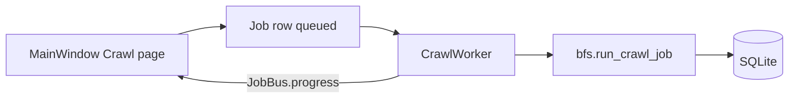

# Architecture

## Layers

| Layer | Responsibility |
|--------|----------------|
| **UI (PyQt6)** | `src/crawlix/ui/` — pages, shell, wizard, `project_dialog.py` (J3); **Keywords** page: keyword table, **`seo_context_json`** targeting + template suggestions (`crawlix.services.keywords.templates`), SERP + **Rank** chart from **`rankings`** (J6–J7); **Citations** page tabs for built-in sources, locations, check history + CSV export (J8 foundation); calls services via workers / facades; **no raw SQL in widgets** (current code uses session in main window for MVP — extract facades as the app grows). |
| **Workers** | `QRunnable` + `QThreadPool` — **CrawlWorker**, **AuditWorker**, **SerpWorker**, **CitationMatrixWorker** (`Job.type` `citation`); **`SimpleTaskWorker`** for short tasks (export, update check). All emit **`JobBus`** signals on the GUI thread (`progress` / `finished` / `failed` for persisted `Job` rows; **`task_progress` / `task_finished` / `task_failed`** for ephemeral UI tasks). |
| **Services** | `src/crawlix/services/` — crawler BFS (`run_crawl_job` supports optional **`on_progress`** callback), audit HTML, SERP **`fetch_serp_placeholder`** + **`ranking_from_serp`** (`Ranking` rows), citations seed (`seed_builtin_sources`), updater, integrations stubs, **`exporters`** (CSV/JSON for pages, links, audits — J4/J5; built-in citation sources CSV — J8). |
| **Persistence** | SQLAlchemy models + Alembic + SQLite file under user data dir. |

## ER (logical)

See product plan ER diagram: `projects` → `pages`, `jobs`, `keywords`, `locations`, …; **`projects` → `crawl_snapshots` → `crawl_snapshot_pages`** (post-crawl graph snapshots); `keywords` → `serp_results` → optional `rankings.serp_result_id`; `citation_sources` (nullable `project_id` for built-ins) → `citation_checks`.

## Data flow (crawl)

Progress: **`CrawlWorker`** passes **`on_progress`** into **`run_crawl_job`** so the BFS loop can report percentage and a short status string without importing Qt inside services.

## Configuration

- **Politeness:** `crawlix.config.PolitenessDefaults` + preset keys in `settings` table.
- **Data directory:** `QSettings` (`COWEBS/Crawlix`, key `data_dir`) + `settings.data_dir` mirror.

## UI Refactor Foundations (May 2026)
- Added taxonomy/insight model (services.analyzer.insights) to decouple severity from priority.
- Added action hub service (services.dashboard_action_hub) for dashboard next-step generation.
- Added saved view store (ui.saved_views) for command-bar table persistence contracts.
- Added inspector presenter (ui.inspector_presenter) as shared rendering adapter for contextual insights.

- UI composition now uses reusable **InspectorPanel** / **ActionListPanel** components (`ui/components.py`) and a shared **`page_sections.table_with_inspector_split`** layout helper.

- Extracted pure inspector decision helpers to ui/inspector_logic.py for Crawl/SERP/Citations context rules (reduces MainWindow UI-logic coupling).

- Added UI controller helpers: ui/controllers_dashboard.py and ui/controllers_inspector.py to move summary/action formatting and audit inspector rendering out of MainWindow.

- Added ui/controllers_inspector_secondary.py to centralize SERP and Citation inspector presentation text assembly, further reducing MainWindow coupling.

- Added ui/controllers_crawl.py to encapsulate crawl detail hint/insight text assembly and further reduce MainWindow responsibilities.

- Added ui/controllers_actions.py to centralize dashboard action-target routing and remove inline navigation parsing from MainWindow.

- Added ui/controllers_audit.py to centralize audit row metadata shaping and issue count normalization.

- Added ui/controllers_serp.py to isolate SERP snapshot row metadata composition and organic count normalization.

- Added ui/controllers_citations.py to isolate citation check row metadata shaping and clipping rules.

## Next implementation priorities

Engineering-led refactors and risks (MainWindow extraction order, SSRF DNS hardening, internal-link aggregation semantics, action-hub evolution): **[next-refactors-and-risks.md](next-refactors-and-risks.md)**.
