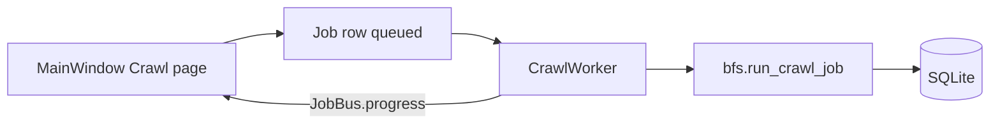

# Architecture

## Layers

| Layer | Responsibility |
|--------|----------------|
| **UI (PyQt6)** | `src/crawlix/ui/` — pages, shell, wizard, `project_dialog.py` (J3); **Keywords** page tables + SERP + **Rank** chart from **`rankings`** (J6–J7); **Citations** page tabs for built-in sources, locations, check history + CSV export (J8 foundation); calls services via workers / facades; **no raw SQL in widgets** (current code uses session in main window for MVP — extract facades as the app grows). |
| **Workers** | `QRunnable` + `QThreadPool` — **CrawlWorker**, **AuditWorker**, **SerpWorker**, **CitationMatrixWorker** (`Job.type` `citation`); **`SimpleTaskWorker`** for short tasks (export, update check). All emit **`JobBus`** signals on the GUI thread (`progress` / `finished` / `failed` for persisted `Job` rows; **`task_progress` / `task_finished` / `task_failed`** for ephemeral UI tasks). |
| **Services** | `src/crawlix/services/` — crawler BFS (`run_crawl_job` supports optional **`on_progress`** callback), audit HTML, SERP **`fetch_serp_placeholder`** + **`ranking_from_serp`** (`Ranking` rows), citations seed (`seed_builtin_sources`), updater, integrations stubs, **`exporters`** (CSV/JSON for pages, links, audits — J4/J5; built-in citation sources CSV — J8). |
| **Persistence** | SQLAlchemy models + Alembic + SQLite file under user data dir. |

## ER (logical)

See product plan ER diagram: `projects` → `pages`, `jobs`, `keywords`, `locations`, …; `keywords` → `serp_results` → optional `rankings.serp_result_id`; `citation_sources` (nullable `project_id` for built-ins) → `citation_checks`.

## Data flow (crawl)

Progress: **`CrawlWorker`** passes **`on_progress`** into **`run_crawl_job`** so the BFS loop can report percentage and a short status string without importing Qt inside services.

## Configuration

- **Politeness:** `crawlix.config.PolitenessDefaults` + preset keys in `settings` table.
- **Data directory:** `QSettings` (`COWEBS/Crawlix`, key `data_dir`) + `settings.data_dir` mirror.
